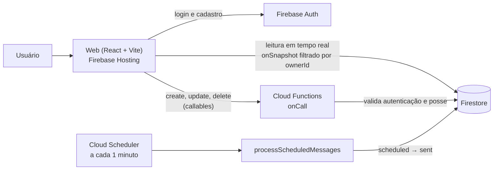

# Broadcast

Aplicação **multi-tenant** de broadcast de mensagens (envio simulado), construída com **React, TypeScript, Vite e Firebase** (Authentication, Firestore, Cloud Functions e Hosting).


**Aplicação publicada:** https://challenge-broadcast-tecuc.web.app

---

## Sumário

- [Funcionalidades](#funcionalidades)
- [Arquitetura](#arquitetura)
- [Modelo de dados](#modelo-de-dados)
- [Isolamento entre clientes](#isolamento-entre-clientes)
- [Agendamento de mensagens](#agendamento-de-mensagens)
- [Requisitos técnicos e onde foram atendidos](#requisitos-técnicos-e-onde-foram-atendidos)
- [Estrutura do repositório](#estrutura-do-repositório)
- [Como rodar localmente](#como-rodar-localmente)
- [Scripts](#scripts)
- [Testes](#testes)
- [Deploy](#deploy)
- [Desenvolvimento orientado a spec e IA](#desenvolvimento-orientado-a-spec-e-ia)
- [Decisões e trade-offs](#decisões-e-trade-offs)
- [Autor](#autor)

---

## Funcionalidades

**Autenticação**

- Login e cadastro com e-mail e senha (Firebase Authentication).
- Cada usuário cadastrado é um cliente (tenant) da aplicação.
- Rotas privadas protegidas; sessão persistida entre recarregamentos.

**Conexões**

- CRUD de conexões (nome), com listagem em tempo real.

**Contatos**

- Cada conexão possui a sua própria lista de contatos (nome e telefone).
- CRUD completo, com listagem em tempo real.

**Broadcast**

- Seleção de um ou mais contatos da conexão e escrita da mensagem.
- Envio imediato (simulado): a mensagem é criada como **Enviada**.
- Agendamento para data e hora futuras: a mensagem é criada como **Agendada**.
- Listagem em tempo real das mensagens, com filtro **Todas / Agendadas / Enviadas**.
- Edição de mensagens agendadas e exclusão de mensagens.
- Uma mensagem agendada passa para **Enviada** automaticamente quando chega o horário, por uma Cloud Function, sem depender do usuário estar com a aplicação aberta.

---

## Arquitetura



- **Leituras** acontecem direto do Firestore com `onSnapshot` (tempo real), sempre filtradas pelo `ownerId` do usuário logado.
- **Escritas** (criar, editar e excluir conexões, contatos e mensagens) passam por **Cloud Functions callable**, que validam autenticação, propriedade dos dados e regras de negócio no backend.
- **Agendamento** é resolvido por uma função agendada, executada pelo Cloud Scheduler.

---

## Modelo de dados

Collections **flat** (sem subcoleções). O tenant é identificado pelo campo `ownerId` (igual ao `uid` do Firebase Auth), presente em todos os documentos. O relacionamento entre entidades é feito por referência (`connectionId`, `contactIds`).

### `connections`

| Campo                    | Tipo      | Descrição                         |
| ------------------------ | --------- | --------------------------------- |
| `ownerId`                | string    | `uid` do cliente dono da conexão  |
| `name`                   | string    | Nome da conexão                   |
| `createdAt`, `updatedAt` | timestamp | Controle de criação e atualização |

### `contacts`

| Campo                    | Tipo      | Descrição                         |
| ------------------------ | --------- | --------------------------------- |
| `ownerId`                | string    | `uid` do cliente dono             |
| `connectionId`           | string    | Conexão à qual o contato pertence |
| `name`                   | string    | Nome do contato                   |
| `phone`                  | string    | Telefone do contato               |
| `createdAt`, `updatedAt` | timestamp | Controle de criação e atualização |

### `messages`

| Campo                    | Tipo                      | Descrição                                           |
| ------------------------ | ------------------------- | --------------------------------------------------- |
| `ownerId`                | string                    | `uid` do cliente dono                               |
| `connectionId`           | string                    | Conexão da mensagem                                 |
| `contactIds`             | string[]                  | Contatos de destino                                 |
| `message`                | string                    | Texto da mensagem                                   |
| `status`                 | `"scheduled"` \| `"sent"` | Agendada ou Enviada                                 |
| `scheduledAt`            | timestamp \| null         | Data de envio programada (`null` no envio imediato) |
| `sentAt`                 | timestamp \| null         | Momento do envio (`null` enquanto agendada)         |
| `createdAt`, `updatedAt` | timestamp                 | Controle de criação e atualização                   |

### Índices compostos

Versionados em [`firestore.indexes.json`](./firestore.indexes.json). O principal é `messages (status, scheduledAt)`, usado pelo agendador para localizar as mensagens vencidas; os demais atendem às listagens filtradas por `ownerId` e `connectionId`.

---

## Isolamento entre clientes

Um cliente nunca enxerga nem manipula dados de outro. A garantia é feita em camadas:

1. **Autenticação obrigatória.** Toda callable rejeita chamadas sem usuário autenticado (`unauthenticated`) antes de qualquer acesso ao banco.
2. **`ownerId` vem do token.** Nas callables, o dono do documento é sempre o `uid` autenticado; qualquer `ownerId` enviado no payload é ignorado.
3. **Verificação de posse.** Editar ou excluir um documento de outro cliente (ou inexistente) responde `not-found`, sem revelar a existência do recurso.
4. **Integridade entre entidades.** Ao criar uma mensagem, a conexão e cada contato informado precisam pertencer ao usuário e à mesma conexão; caso contrário a operação é negada.
5. **Firestore Security Rules** ([`firestore.rules`](./firestore.rules)) restringem o acesso aos documentos do dono (`ownerId == request.auth.uid`).
6. **Queries filtradas.** Todas as consultas do front usam `where('ownerId', '==', uid)`, compatível com as regras.

---

## Agendamento de mensagens

A função `processScheduledMessages` é uma Cloud Function agendada (`onSchedule`, região `southamerica-east1`), executada **a cada minuto** pelo Cloud Scheduler:

1. Busca as mensagens com `status == "scheduled"` e `scheduledAt <= agora` (até 100 por execução).
2. Atualiza todas em um único `batch`: `status = "sent"`, `sentAt` e `updatedAt`.
3. Os clientes conectados recebem a mudança em tempo real pelo `onSnapshot`, sem recarregar a página.

Pontos importantes:

- Acontece **inteiramente no backend**: funciona com a aplicação fechada.
- O horário informado no formulário é interpretado no fuso **America/Sao_Paulo (UTC-3)**, e o backend só aceita datas futuras.
- A granularidade é de 1 minuto: uma mensagem pode ser marcada como enviada até cerca de 1 minuto após o horário agendado.
- Mensagens **enviadas** não podem ser editadas.
- O Functions Emulator **não dispara funções agendadas sozinho**. Para validar o fluxo completo (Agendada → Enviada), use o ambiente publicado, onde o Cloud Scheduler executa a função.

---

## Requisitos técnicos e onde foram atendidos

| Requisito                                            | Como foi atendido                                                                                                                          |
| ---------------------------------------------------- | ------------------------------------------------------------------------------------------------------------------------------------------ |
| Estrutura SaaS multi-tenant                          | `ownerId` em todos os documentos; cada conexão agrega seus contatos e mensagens                                                            |
| Isolamento entre clientes                            | Autenticação nas callables, posse verificada no backend, Security Rules e queries filtradas (ver [Isolamento](#isolamento-entre-clientes)) |
| Material UI + Tailwind CSS                           | MUI para componentes e comportamento; Tailwind v4 para layout e estilização                                                                |
| Código limpo e organizado                            | Front em Atomic Design, schemas de validação, camada de services, módulos por domínio nas functions, TypeScript estrito                    |
| Paradigma funcional (sem OO)                         | Componentes funcionais, hooks e funções puras                                                                                              |
| Tempo real do Firestore                              | `onSnapshot` nas listagens de conexões, contatos e mensagens                                                                               |
| Frontend com Vite                                    | `/web` criado com Vite                                                                                                                     |
| Sem subcoleções                                      | Collections flat: `connections`, `contacts`, `messages`                                                                                    |
| Separação `/functions` e `/web`                      | Duas aplicações independentes na raiz do repositório                                                                                       |
| Modelagem e estratégia de isolamento                 | Seções [Modelo de dados](#modelo-de-dados) e [Isolamento entre clientes](#isolamento-entre-clientes)                                       |
| Firebase Authentication, Firestore e Cloud Functions | Todos utilizados; deploy do front no Firebase Hosting                                                                                      |

---

## Estrutura do repositório

```
.
├── web/                      # Frontend (React + Vite)
│   └── src/
│       ├── components/
│       │   ├── atoms/
│       │   ├── molecules/
│       │   ├── organisms/    # Dialogs, Header
│       │   └── templates/    # Telas: Login, Signup, Conexões, Contatos, Mensagens
│       ├── contexts/         # Contexto de autenticação
│       ├── interfaces/
│       ├── schemas/          # Validação com zod
│       ├── services/         # Acesso ao Firebase (leitura em tempo real e callables)
│       ├── utils/
│       └── test/             # Setup e helpers de teste
├── functions/                # Cloud Functions (Node 22 + TypeScript)
│   └── src/
│       ├── config/           # Inicialização do Admin SDK
│       ├── interfaces/
│       ├── modules/
│       │   ├── connections/
│       │   ├── contacts/
│       │   ├── messages/
│       │   └── scheduled/    # processScheduledMessages
│       ├── utils/
│       └── index.ts          # Exporta as functions
├── docs/
│   ├── specs/                # Requisitos, arquitetura, dados, segurança e tasks
│   └── adr/                  # Decisões arquiteturais
├── .claude/agents/           # Subagents que implementam e revisam contra a spec
├── CLAUDE.md                 # Contexto do projeto para a IA
├── firebase.json
├── firestore.rules
├── firestore.indexes.json
└── .firebaserc
```

---

## Como rodar localmente

### Pré-requisitos

- Node.js 22
- JDK instalado (exigido pelo emulator do Firestore)
- Um projeto Firebase com um app Web registrado

### Passo a passo

```bash
# 1. dependências
npm install
npm --prefix web install
npm --prefix functions install

# 2. variáveis de ambiente do front
cp web/.env.example web/.env
# preencha com as chaves do app Web (Firebase Console > Project settings > Your apps)

# 3. build das functions (o emulator carrega a pasta lib/)
npm run build:functions

# 4. pasta de persistência dos emulators (primeira execução)
mkdir -p .emulator-data

# 5. emulators (terminal 1)
npm run dev

# 6. frontend (terminal 2)
npm run dev:web
```

| Serviço            | Endereço              |
| ------------------ | --------------------- |
| Frontend (Vite)    | http://localhost:5173 |
| Emulator UI        | http://localhost:4000 |
| Auth emulator      | `127.0.0.1:9099`      |
| Firestore emulator | `127.0.0.1:8080`      |
| Functions emulator | `127.0.0.1:5001`      |
| Hosting emulator   | `127.0.0.1:5000`      |

Ao alterar o código das functions, recompile com `npm --prefix functions run build:watch` em um terceiro terminal.

### Variáveis de ambiente (`web/.env`)

| Variável                    | Descrição                                          |
| --------------------------- | -------------------------------------------------- |
| `VITE_FIREBASE_API_KEY`     | API key do app Web                                 |
| `VITE_FIREBASE_AUTH_DOMAIN` | `<project-id>.firebaseapp.com`                     |
| `VITE_FIREBASE_PROJECT_ID`  | ID do projeto                                      |
| `VITE_FIREBASE_APP_ID`      | App ID do app Web                                  |
| `VITE_USE_EMULATORS`        | `true` para usar os emulators, `false` em produção |

> As variáveis do Vite são embutidas **no build**. Para publicar, use `web/.env.production` com `VITE_USE_EMULATORS=false` antes de gerar o build.

---

## Scripts

Na raiz do repositório:

| Script                    | Descrição                                                     |
| ------------------------- | ------------------------------------------------------------- |
| `npm run dev`             | Sobe os emulators do Firebase (com import/export de dados)    |
| `npm run dev:web`         | Servidor de desenvolvimento do frontend                       |
| `npm run build:web`       | Build de produção do frontend                                 |
| `npm run build:functions` | Compila as Cloud Functions                                    |
| `npm run build`           | Build do front e das functions                                |
| `npm run test`            | Testes do front e das functions                               |
| `npm run deploy`          | Build e deploy completo (rules, índices, functions e hosting) |
| `npm run deploy:hosting`  | Build e deploy apenas do front                                |

---

## Testes

Os testes usam **Vitest**.

**Frontend (`/web`)** com Testing Library:

- Telas de login e cadastro: validação, chamada de autenticação, mensagens de erro e estado de envio.
- Telas de conexões, contatos e mensagens: assinatura em tempo real com o `uid` do usuário, fluxos de criar, editar e excluir, filtros por status, envio imediato e agendado, tratamento de erro e navegação.
- Dialogs (conexão, contato e mensagem): validação dos formulários, preenchimento na edição, reset ao reabrir, bloqueio durante o envio.

**Functions (`/functions`)**:

- `processScheduledMessages`: configuração do agendamento, filtro de mensagens vencidas, atualização em lote e propagação de erros.
- Callables de conexões, contatos e mensagens: autenticação obrigatória, `ownerId` derivado do token, validação de entrada, isolamento entre clientes, bloqueio de edição de mensagem enviada e regra de data futura.

```bash
# tudo
npm run test

# front
npm --prefix web run test:run
npm --prefix web run test:coverage

# functions
npm --prefix functions run test
npm --prefix functions run test:coverage
npm --prefix functions run typecheck
```

---

## Deploy

### Pré-requisitos no Firebase

- Projeto no plano **Blaze** (necessário para Cloud Functions e Cloud Scheduler; o uso deste projeto cabe nas cotas gratuitas).
- **Authentication:** método _Email/Password_ habilitado.
- **Firestore Database** criado.

### Publicação

```bash
npx firebase login
npx firebase use <PROJECT_ID>

# 1. variáveis de produção (web/.env.production) com VITE_USE_EMULATORS=false

# 2. regras e índices primeiro
npx firebase deploy --only firestore

# 3. build e deploy completo
npm run deploy
```

Aguarde os índices ficarem com status **Ready** (Firebase Console > Firestore > Indexes) antes de testar a listagem e o agendamento; sem o índice `messages (status, scheduledAt)` a função agendada falha com `FAILED_PRECONDITION`.

O Hosting serve `web/dist` com _rewrite_ de SPA para `index.html`, então o recarregamento em qualquer rota funciona.

### Verificação pós-deploy

1. Abra a URL, cadastre-se e faça login.
2. Crie uma conexão, contatos e envie uma mensagem imediata.
3. Agende uma mensagem para daqui a 2 minutos e feche a aba.
4. Ao reabrir, a mensagem deve estar como **Enviada**.
5. Crie um segundo usuário e confirme que ele não enxerga nenhum dado do primeiro.

---

## Desenvolvimento orientado a spec e IA

O projeto foi construído com **spec-driven development**, usando IA com contexto documentado:

- [`docs/specs/`](./docs/specs): fonte de verdade com requisitos (com IDs rastreáveis), arquitetura, modelo de dados, segurança e a fila de tasks.
- [`docs/adr/`](./docs/adr): registro das decisões arquiteturais e seus trade-offs.
- [`CLAUDE.md`](./CLAUDE.md): contexto e regras do projeto lidos automaticamente pelo agente de IA.
- [`.claude/agents/`](./.claude/agents): subagents especializados, um que implementa tasks seguindo a spec e outro que revisa o código contra ela.

Fluxo: **Spec → Task → Implementação → Revisão contra a spec**. Mudou um comportamento? A spec é atualizada **antes** do código.

---

## Decisões e trade-offs

As decisões completas estão em [`docs/adr/`](./docs/adr). As principais:

| Decisão                                      | Motivo                                                                 | Trade-off                                                                                                                                          |
| -------------------------------------------- | ---------------------------------------------------------------------- | -------------------------------------------------------------------------------------------------------------------------------------------------- |
| Collections flat com `ownerId` denormalizado | Atende à restrição de não usar subcoleções; consultas e regras simples | O `ownerId` precisa ser mantido em todos os documentos                                                                                             |
| Escritas por Cloud Functions callable        | Autenticação, posse e regras de negócio validadas no backend           | Um salto a mais de rede em relação à escrita direta no Firestore                                                                                   |
| Leituras diretas com `onSnapshot`            | Tempo real nativo, sem polling no cliente                              | Dependem das Security Rules e de queries filtradas por `ownerId`                                                                                   |
| Agendador por polling de 1 minuto            | Simples, idempotente (consulta por status) e sem estado extra          | Precisão de até 1 minuto. A alternativa, Cloud Tasks por mensagem, daria precisão ao segundo com mais complexidade de reagendamento e cancelamento |
| Mensagem enviada é imutável                  | Mantém o histórico consistente com o que foi disparado                 | Correções exigem uma nova mensagem                                                                                                                 |

---

## Autor

**Iury Lemos**, desenvolvedor Full Stack.

- GitHub: [@iurylemos](https://github.com/iurylemos)
- LinkedIn: [linkedin.com/in/iurylemos](https://www.linkedin.com/in/iurylemos/)
